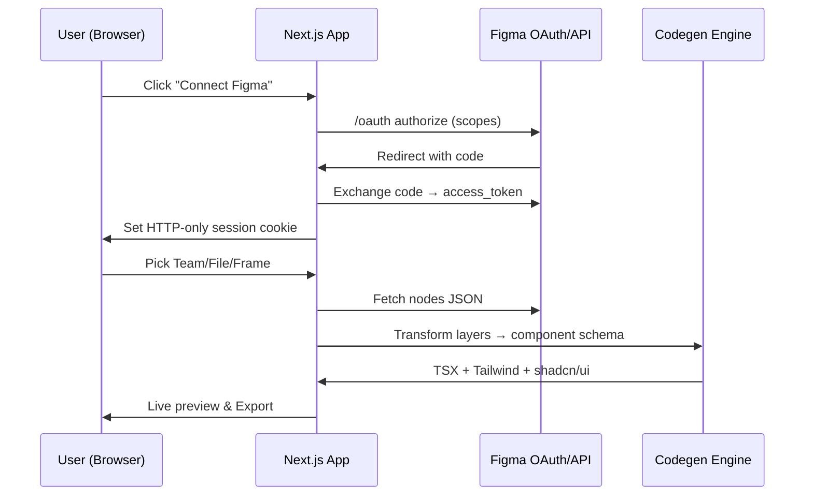

# LayoutSmith — Figma → React Componentizer

**Live demo:** [https://layoutsmith.vercel.app/](https://layoutsmith.vercel.app/)

Generate clean, production‑ready React/Next.js components from Figma designs. LayoutSmith connects to your Figma account, lets you pick files/teams, and converts selected frames into typed React components styled with Tailwind and shadcn/ui. Includes an in‑browser live preview and export workflow.

---

## ✨ Highlights

* **Figma OAuth** (scopes pre‑configured) → pick Team/File/Frame
* **Codegen** → React + TypeScript, Tailwind (v4), shadcn/ui, lucide-react icons
* **Live Preview** → render generated components in the browser
* **One‑click Export** → download components or copy to clipboard
* **Next.js 14 app router** → serverless API routes for Figma OAuth callback
* **State & Data** → Redux Toolkit for app state; session cookie for OAuth
* **Deploy‑ready** → Developed and deployed on **Vercel**

> ⚠️ Privacy: Only the frames you choose are fetched. Tokens are stored in an HTTP‑only session cookie by default; swap to your own store for production.

---

## 📸 Screenshots

*(Add your images to `docs/screenshots/` and update paths)*

| Connect                                  | Choose file                          | Preview & Export                         |
| ---------------------------------------- | ------------------------------------ | ---------------------------------------- |
|  |  |  |

---

## 🧱 Tech Stack

* **Frontend**: Next.js 14, React 18, TypeScript
* **Styling**: Tailwind CSS **v4** (`@import "tailwindcss";`), shadcn/ui, lucide-react
* **State**: Redux Toolkit
* **APIs**: Figma REST API + OAuth 2.0
* **Infra**: Vercel (Edge/Node runtimes)
* **Optional GenAI**: AWS Bedrock (Claude) for helper prompts / naming (off by default)

---

## 🗺️ How it works



---

## 🔧 Local Development

### Prerequisites

* **Node.js ≥ 18.17**
* **pnpm** (preferred) or yarn/npm
* A **Figma** account & a Figma OAuth app (for local testing you can also use Personal Access Token, but OAuth is recommended)

### 1) Clone & install

```bash
git clone <your-fork-or-repo-url>
cd layoutsmith
pnpm install
```

### 2) Environment variables

Create a `.env.local` in the project root:

```bash
# App
NEXT_PUBLIC_APP_NAME=LayoutSmith
NEXT_PUBLIC_APP_URL=http://localhost:3000
NODE_ENV=development

# Figma OAuth (recommended)
FIGMA_CLIENT_ID=your_figma_oauth_client_id
FIGMA_CLIENT_SECRET=your_figma_oauth_client_secret
FIGMA_REDIRECT_URI=http://localhost:3000/api/figma/callback
FIGMA_COOKIE_SECRET=super-long-random-string

# Optional: Figma Personal Access Token (for scripts/testing only)
# FIGMA_PERSONAL_ACCESS_TOKEN=figd_...

# Optional: AWS Bedrock (GenAI helpers)
BEDROCK_MODEL_ID=anthropic.claude-3-5-sonnet-20240620-v1:0
AWS_BEARER_TOKEN_BEDROCK=***
AWS_REGION=us-east-1
```

> **Production tip:** On Vercel, set `FIGMA_REDIRECT_URI` to `https://layoutsmith.vercel.app/api/figma/callback` (no double slash) and add the same URL in your Figma app settings.

### 3) Run dev server

```bash
pnpm dev
# http://localhost:3000
```

---

## 🗂️ Project Structure

```text
src/
  app/
    api/
      figma/
        auth/route.ts           # (optional) begins OAuth; redirects to Figma
        callback/route.ts       # handles Figma OAuth callback → session cookie
    layout.tsx
    page.tsx                    # main UI
    providers/ReduxProvider.tsx # app-level store provider
  components/
    ConnectFigmaCard.tsx
    FigmaConnected.tsx
    import/TeamIdPrompt.tsx
    preview/LivePreview.tsx     # renders generated elements safely
  lib/
    figma.ts                    # typed fetchers for Figma REST
    codegen/                    # nodes → component schema → TSX
    relativeTime.ts             # small date-utils (ensure exports)
  styles/
    globals.css                 # Tailwind v4 (@import "tailwindcss")
  store/
    index.ts                    # Redux store
    slices/
      figmaSlice.ts
      generatorSlice.ts
```

---

## 🧰 Tailwind CSS v4

This project uses **Tailwind v4** with the new `@import "tailwindcss"` entry in `globals.css` and optional `@theme inline` variables.

* If you need custom themes, update `:root` CSS vars and `@theme inline`.
* No `tailwind.config.ts` is required for basic usage, but you can add one for plugins or advanced theming.

Example from `src/styles/globals.css`:

```css
@import "tailwindcss";

@tailwind base;
@tailwind components;
@tailwind utilities;

:root {
  --background: #0a0a0a;
  --foreground: #ededed;
}

@theme inline {
  --color-background: var(--background);
  --color-foreground: var(--foreground);
}
```

---

## 🔐 Figma OAuth Setup

1. Go to **Figma → Settings → Developer → Create new OAuth app**
2. Add **Redirect URI**:

   * Local: `http://localhost:3000/api/figma/callback`
   * Prod:  `https://layoutsmith.vercel.app/api/figma/callback`
3. Scopes to enable (read‑only):

   * `current_user:read`
   * `projects:read`
   * `file_content:read`
   * `file_metadata:read`
   * `file_versions:read`
   * `file_comments:read`
   * `library_content:read`
4. Put the Client ID/Secret into `.env.local`
5. Start the app and click **Connect Figma**

> If you previously had a double slash in the redirect URL (e.g., `/api//figma/callback`), fix it both in Figma app settings **and** your env.

---

## 🧪 Testing the Flow

1. **Connect** → completes OAuth → you see Figma username
2. **Select Team / File** → files list should populate
3. **Choose Frame(s)** → preview updates
4. **Export** → download TSX files or copy code

If you don’t see files, ensure your account has access to the team and the OAuth scopes above are enabled.

---

## 🧠 Codegen Notes

* Generated components aim for:

  * Semantic HTML structure
  * Tailwind utility classes (minimal, readable)
  * Optional shadcn/ui wrappers for common primitives
* Mapping is rule‑based today; plug in LLM helpers (Bedrock/OpenAI) to:

  * suggest component names
  * simplify utility classes
  * infer reusable variants

---

## ▶️ Scripts

```json
{
  "scripts": {
    "dev": "next dev",
    "build": "next build",
    "start": "next start",
    "lint": "next lint",
    "typecheck": "tsc --noEmit"
  }
}
```

---

## 🔌 API Routes

* `GET /api/figma/auth` → (optional) starts OAuth
* `GET /api/figma/callback` → completes OAuth and sets session

> For production, consider moving to NextAuth or your preferred auth library and a durable session store (Redis/Supabase/Postgres).

---

## 🆘 Troubleshooting

* **Redirect URI mismatch** → Ensure exact match in Figma app & `FIGMA_REDIRECT_URI`
* **Module not found: `ReduxProvider`** → verify path `src/app/providers/ReduxProvider.tsx` and imports
* **Objects are not valid as a React child** in `LivePreview` → ensure preview returns a valid JSX element tree; if you evaluate code, wrap exports with a runtime container (`<Stage />`) and guard against `null/undefined`
* **403 from Figma** → token expired; disconnect and re‑connect

---

## 📦 Export & Integration

Exports generate a `/generated/` folder (local) or an in‑browser ZIP. Drop the components into any React/Next.js app. If you use **shadcn/ui**, make sure your target app has it installed and configured.

---

## 🗺️ Roadmap

* [ ] Multi‑frame batch export
* [ ] Auto‑variants (Button, Card, Input)
* [ ] Component library sync back to Figma
* [ ] CLI for CI‑driven updates
* [ ] Pluggable rulesets per design system

---

## 🤝 Contributing

PRs welcome! Please open an issue first for discussion if you’re changing codegen rules. Run `pnpm lint && pnpm typecheck` before pushing.

---

## 📝 License

MIT © LayoutSmith contributors

---

## 🙏 Acknowledgements

Figma Platform team, Tailwind Labs, shadcn/ui, lucide‑react, Vercel.
